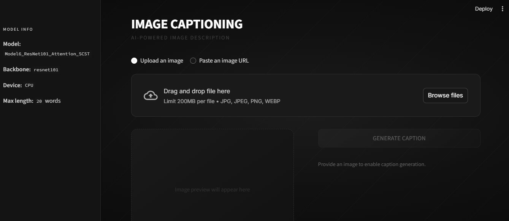

# 🖼️ Image Captioning System

An end-to-end deep learning pipeline for automatic image captioning, built with CNN encoders and an attention-based LSTM decoder. Trained and evaluated on the **Flickr8k** dataset, with a Streamlit web application for deployment.

---

## 🖥️ Web Application



---

## 📌 Project Overview

This project implements and compares **6 image captioning models** across two CNN backbones and three architectural variants, trained using a two-stage pipeline: cross-entropy loss followed by Self-Critical Sequence Training (SCST) with CIDEr as the reward signal.

---

## 🗂️ Project Structure

```
├── data/
│   ├── flickr8k/
│   │   └── Images/                  # Flickr8k images
│   ├── prepared/                    # Cleaned and split captions
│   └── features/                    # Pre-extracted CNN features
│       ├── vgg16/
│       └── resnet101/
├── checkpoints/                     # Model checkpoints per epoch
├── results/                         # Training results and vocab
│   ├── vocab.json
│   ├── best_model.pt                # Best overall model
│   └── *.png                        # Loss curves and comparison plots
├── flickr8k_data_preparation.ipynb  # Data exploration and cleaning
├── flickr8k_modelling.ipynb         # Model training and evaluation
├── flickr8k_deep_evaluation.ipynb   # Deep model comparison
├── app.py                           # Streamlit web application
├── requirements.txt
├── .streamlit/
│   └── config.toml                  # App theme configuration
└── LICENSE
```

---

## 🧠 Models Compared

| # | CNN Backbone | Architecture         | Training              |
|---|--------------|----------------------|-----------------------|
| 1 | VGG16        | LSTM — No Attention  | Cross-Entropy         |
| 2 | VGG16        | LSTM + Attention     | Cross-Entropy         |
| 3 | VGG16        | LSTM + Attention     | Cross-Entropy + SCST  |
| 4 | ResNet-101   | LSTM — No Attention  | Cross-Entropy         |
| 5 | ResNet-101   | LSTM + Attention     | Cross-Entropy         |
| 6 | ResNet-101   | LSTM + Attention     | Cross-Entropy + SCST  |

---

## 🏗️ Architecture

```
Image → CNN Encoder → Spatial Feature Map (49 × 512)
                              ↓
                     Soft Attention (per step)
                              ↓
              LSTM Decoder ← [embed(wₜ₋₁) ; ẑₜ]
                              ↓
                         Softmax → wₜ
```

**Key design choices:**
- CNN backbone: VGG16 or ResNet-101 (pretrained on ImageNet, frozen during Stage 1)
- Spatial features: 7×7 grid → 49 location vectors
- Attention: Additive (Bahdanau-style) soft attention
- Decoder: Single LSTM with hidden size 512
- Decoding at inference: Beam search (k=3)

---

## 🏋️ Training Pipeline

### Stage 1 — Cross-Entropy
- Teacher forcing: ground-truth word fed at every step
- Loss: cross-entropy over vocabulary
- Early stopping: patience = 5 on validation loss
- LR scheduler: ReduceLROnPlateau

### Stage 2 — SCST Fine-Tuning (Models 3 & 6)
- Reward: CIDEr(sampled) − CIDEr(greedy)
- Loss: REINFORCE — `−(reward × log_p).mean()`
- Learning rate: 10× smaller than Stage 1

---

## 📊 Evaluation Metrics

- **BLEU-1 / 2 / 3 / 4**
- **CIDEr**
- Per-image scoring, best/worst 20 images, head-to-head comparison

---

## 🚀 Running the App Locally

```bash
# Install dependencies
pip install -r requirements.txt

# Run the Streamlit app
streamlit run app.py
```

Place `best_model.pt` in the path defined by `MODEL_PATH` in `app.py`.

---

## 📦 Requirements

```
streamlit
torch
torchvision
numpy
Pillow
requests
```

---

## 📁 Dataset

**Flickr8k** — 8,000 images, each with 5 human-written captions (40,000 total).

| Split | Images |
|-------|--------|
| Train | 6,000  |
| Val   | 1,000  |
| Test  | 1,000  |

---

## 📄 References

- Xu et al. — *Show, Attend and Tell* (ICML 2015)
- Rennie et al. — *Self-Critical Sequence Training for Image Captioning* (CVPR 2017)
- Anderson et al. — *Bottom-Up and Top-Down Attention for Image Captioning* (CVPR 2018)

---

## 📝 License

This project is licensed under the MIT License. See the [LICENSE](LICENSE) file for details.
